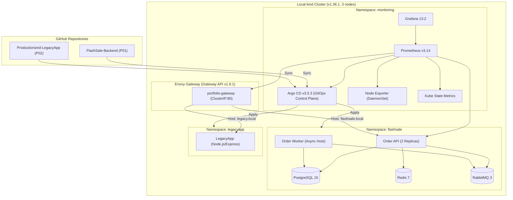

# Local Platform v1.1 — Interview Demo Guide (<= 10 Minutes)

This document provides a battle-tested, zero-cloud demonstration script for SRE / DevOps / Cloud Platform interviews. It demonstrates real Kubernetes infrastructure engineering, Gateway API routing, GitOps reconciliation, and production observability running entirely locally on Apple Silicon / macOS.

---

## 1. System Architecture



---

## 2. 10-Minute Live Demo Flow

### Step 1: Cluster Health & Topology (1 min)
Show the 3-node cluster and node ready states:
```bash
kubectl get nodes -o wide
kubectl get pods -A
```
*Key Talking Points:* 1 control-plane + 2 worker nodes on kind v1.36.1. arm64 native images with 0 emulation overhead. Pinned memory budget (~5.2 GiB on 7.75 GiB Docker VM).

### Step 2: Gateway API & Shared North-South Routing (2 min)
Demonstrate single Envoy Gateway multiplexing traffic across isolated namespaces:
```bash
# Port-forward gateway data plane
kubectl -n envoy-gateway-system port-forward svc/envoy-platform-gateway-portfolio-gateway-d6017b10 8088:80 &

# P02: LegacyApp routing
curl -i -H "Host: legacy.local" http://127.0.0.1:8088/health

# P01: FlashSale routing
curl -i -H "Host: flashsale.local" http://127.0.0.1:8088/healthz

# Negative Control: Unmatched host
curl -i -H "Host: unmatched.local" http://127.0.0.1:8088/
```
*Key Talking Points:* No deprecated ingress-nginx. Pure Gateway API standard (`GatewayClass`, `Gateway`, `HTTPRoute`). Full host-based isolation with non-interfering HTTPRoutes.

### Step 3: FlashSale Business E2E Flow (3 min)
Demonstrate distributed transaction with JWT authentication, Redis pre-filtering, RabbitMQ queue decoupling, and PostgreSQL settlement:
```bash
# 1. Register & Login
TOKEN=$(curl -s -X POST http://127.0.0.1:8088/api/auth/register \
  -H "Host: flashsale.local" -H "Content-Type: application/json" \
  -d '{"email":"demo@example.com","password":"Password123!@#"}' | jq -r .accessToken)

# 2. Place authenticated order with Idempotency Key
IDEM="demo-$(date +%s)"
curl -i -X POST http://127.0.0.1:8088/api/orders \
  -H "Host: flashsale.local" -H "Content-Type: application/json" \
  -H "Authorization: Bearer $TOKEN" \
  -H "Idempotency-Key: $IDEM" \
  -d '{"productId":5,"quantity":1}'
# -> HTTP 202 Accepted, status: processing

# 3. Poll for completion
curl -s http://127.0.0.1:8088/api/orders/$IDEM -H "Host: flashsale.local"
# -> HTTP 200 OK, status: completed, orderId assigned

# 4. Confirm payment
curl -i -X POST http://127.0.0.1:8088/api/orders/$IDEM/pay \
  -H "Host: flashsale.local" -H "Content-Type: application/json" \
  -H "Authorization: Bearer $TOKEN" \
  -d '{"outcome":"completed"}'
# -> HTTP 200 OK, status: confirmed
```
*Key Talking Points:* Idempotency keys prevent double purchases. Background worker consumes messages from RabbitMQ and writes to PostgreSQL. Clean Architecture preserves domain boundaries.

### Step 4: Observability in Action (2 min)
Demonstrate Prometheus metrics and Grafana dashboards:
```bash
# Port-forward Grafana
kubectl -n monitoring port-forward svc/kps-grafana 3000:80 &
```
- Open `http://localhost:3000` (User: `admin`, Password: `kubectl -n monitoring get secret grafana-admin -o jsonpath="{.data.admin-password}" | base64 -d`)
- Show Dashboards:
  - **Local Platform Overview**: Real node CPU/memory load.
  - **Argo CD GitOps Overview**: App sync and health telemetry.
  - **Portfolio Workloads**: Container memory/CPU usage for P01/P02.

### Step 5: GitOps Reconciliation & Rollback (2 min)
Explain automated GitOps lifecycle:
- Show Argo CD Applications: `kubectl -n argocd get applications`
- Explain forward deployment proof (`0ccb6f2` / `9461c7a`) and Git revert rollback proof (`308e042` / `9c51e4f`).
- Real drift detection and self-healing.
